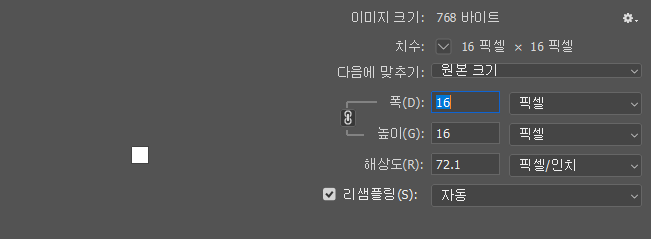

## 1) 2진법

컴퓨터는 트랜지스터라는 스위치를 통해 on, off로 0과 1을 표현한다. 

0과 1, 두가지 값을 가질 수 있는 최소의 측정 단위를 **비트**(binary digit -이진 숫자-)라고 한다. 하나의 비트로는 on, off 혹은 ture, false 등 간단한 데이터만 표현할 수 있기 때문에 컴퓨터는 이를 조합하여 여러가지 정보를 저장한다.

비트를 8개 모아 만들어진 것이 **바이트**이다. 1바이트는 256개의 서로 다른 데이터를 표현할 수 있다. 

1byte === 8bit(2^8)

KB는 1024개의 바이트가, MB는 1024개의 킬로바이트가, GB는 1024개의 MB가 모인 것과 같다. 

## 2) 정보의 표현

* ASCII (아스키)
* 유니코드 
* RGB

### 문자의 표현

**아스키 코드**는 2의 7승(7비트), 즉 128개의 부호로 정의되어 있는 문자이다. (예 : A는 아스키 코드로 65, Z는 90)

그런데 128개의 부호로는 현실에서 사용하는 문자들을 표현하는 데 한계가 있다. 이후 1비트를 추가하여 256개의 문자를 표현할 수 있도록 개선했으나 큰 차이가 없었다.

이러한 한계를 극복하기 위해 새로운 표준인 **유니코드**가 탄생했다. 유니코드는 16진수를 사용하여 100만개 이상의 문자를 표현할 수 있다. 또한 유니코드의 첫 128개의 문자는 아스키 코드의 순서와 동일하기 때문에 서로 호환이 가능하다. 

### 색의 표현

컴퓨터에서의 그림은 하나의 작은 점들로 이루어져 있는데, 이 작은 점을 pixel이라고 부른다. 각 픽셀은 빨간색(R), 초록색(G), 파란색(B)의 세가지 색을 조합하여 특정한 색을 나타낸다. 

R / G / B 각 색의 강도(?)는 0부터 255까지, 총 256가지(2의 8승 = 1바이트)로 표현이 가능하다. 따라서 1픽셀은 3바이트라고 할 수 있다. 

참고: 이미지의 채널을 어떻게 설정하느냐에 따라 용량이 달라진다.

포토샵에서 기본 설정은 8bit이고, 이 설정대로라면 256픽셀(16 X 16) 이미지는 256x3 = 768바이트 의 용량을 가지게 될 것이다. 

그런데 16비트 채널(8비트의 2배)인 경우 1픽셀당 6바이트, 32비트 채널인 경우(8비트의 4배) 1픽셀당 12바이트가 된다. 만약 이진 색상을 사용하는 1비트 채널의 이미지인 경우 1픽셀은 1바이트이다.  

\=> 채널을 어떻게 설정하느냐에 따라 1픽셀의 용량이 달라지므로 1픽셀이 무조건 3바이트인 것은 아니다. 

## 3) 알고리즘

요즘 알고리즘 기초 문제를 풀고 있지만 알고리즘이 무엇인지에 대해 생각하지 않았던 것 같다. 

알고리즘이란 문제를 해결하는 단계적 방법이다. (= 입력 받은 자료(input)를 출력 형태(output)로 만드는 처리 과정)

그런데 알고리즘은 단순히 문제를 해결**(정확성)**하는 것 뿐만 아니라 얼마나 **효율적**인지도 중요하다. 처리해야 할 데이터가 많아지더라도 문제를 해결하는 데에 걸리는 시간과 노력은 최소화해야 한다.

### Pseudo code

알고리즘은 의사(유사, 가짜) 코드라고 하는 방식으로 명료하게 정리할 수 있다.

알고리즘 문제를 풀기 전에  우리가 사용하는 언어를 이용하여 전체 문제를 잘게 나누고 정리해보는 절차를 가질 수 있다. 이러한 과정은 알고리즘 문제를 절차적으로 파악할 수 있도록 도와준다.