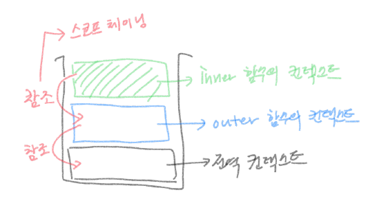

## 실행 컨텍스트와 스코프, 스코프 체인

여러 자바스크립트 강의를 들으며 실행 컨텍스트와 스코프에 대해 많은 설명을 들었지만 말로 설명하기 어려워 글로 정리하는 기회를 가져보려고 한다.

연결한 넷리파이 에디터가 한글을 사용하면 이상하게 한글자씩 밀리는데, 이것을 좀 고쳐보고 싶다... 

아무튼..!

호이스팅에 관련하여 작성한 적이 있는데 알고보니 호이스팅도 실행 컨텍스트와 크게 관련이 있었다. 자바스크립트는 **코드를 실행하기 위해 필요한 정보들을 모아 놓은 객체를 필요로 하는데, 이게 바로 실행 컨텍스트다**.

자바스크립트 실행 컨텍스트가 어떻게 동작하는지 살펴보면,

1. 첫번째로 컴퓨터가 코드를 쭉 보며 선언된 함수(함수 선언)과 변수를 모두 상단으로 끌어올린다. 이 변수들은 전역 컨텍스트가 된다. 
2. 호이스팅 발생이후 코드를 순차적으로 읽으며 함수를 실행시킨다. 이 과정에서 함수 내부에 선언된 변수를 함수 컨텍스트에 저장한다. 
3. 이어서 그 내부에 또 함수가 있을 경우 이 함수 내부에서 필요한 값들을 해당 함수 실행 컨텍스트에 넣는다... 
4. 함수가 실행된 후 코드에서 벗어나면 해당 실행 컨텍스트를 삭제한다. ...반복. 

이렇게 **어떠한 함수가 실행에 필요한 변수를 찾기 위해 접근할 수 있는 범위를 스코프**라고 할 수 있다.  

예를 들어 outer라는 함수 내부에 inner라는 함수가 있다. inner함수를 실행하려면 변수 a가 필요하다고 가정해보자.

그런데 inner함수 안에는 변수 a가 없었다. 이 경우 자바스크립트는 그 부모 함수인 outer함수에서 변수 a를 찾아본다. 만약 outer안에도 a가 없다면, 전역에 선언된 a가 있는지 찾아본다. 

\=> 이렇게 **스코프**를 하나하나 내려(?)가며 찾는 것을 스코프가 서로 연결되어 있다고 하여 **스코프 체인**이라고 부른다. 

이러한 스코프 체인의 특성을 이용한 것이 클로저(내부함수가 부모함수의 변수를 참조하는 방식 - 외부에서 변수가 의도치 않게 변경되는 것(사이드 이펙)을 막는다.)이다. 

\==============

자바스크립트 개념 강의를 들으면서 느꼈던 것은 어렴풋이 내가 알고 있는 내용이 많았다는 것이다. 단지 명칭을 달아서 정리하지 못했던 것 뿐이지... 공부를 하면서 누군지 몰랐던 이의 이름을 알게 된 기분이다. 

이렇게 정리를 해보니 조금 정돈이 되는 것 같다. 하지만 이렇게 개념만 공부해서는 언젠가 잊어버린 것 같으니 실무에서 응용할 수 있기를 바란다.