HTML, CSS, Javascript을 이용해 그림판을 만들 기회가 생겼다. 

사용할 수 있는 정도라서 배포해 본 링크 :  <https://drawing-on-html-morgon.netlify.app/>

추가한 기능은 아래와 같다.

## 구현한 기능

* 펜, 지우개, 타원, 직사각형 툴
* 선, 내부 면(Fill Color) 색상 변경 가능
* 지우개, 펜 툴 굵기 조절하기
* 그림 새로 그리기
* 그림 jpg로 저장하기 (품질 : 최대)
* 이미지 파일 로드

  * 이미지는 정중앙에 배치
  * 이미지의 가로, 세로 사이즈가 캔버스의 넓이, 높이보다 크거나 같을 경우 자동으로 비율 조정을 하여 이미지가 잘리지 않게 배치
* IE를 제외한 모든 브라우저에서 사용 가능할 것

만들면서 어려웠던 부분은 도형 & 지우개 툴이었는데, 이 둘 덕분에 코드가 2배 정도 길어졌다. 글의 부제를 두더지 잡기로 정한 이유도 어디 하나를 고치면 다른 어딘가에서 문제가 튀어나왔기 때문이다...

## 도형 툴 만들기

기본적으로  mousedown, mousemove 이벤트를 이용하여 현재 마우스의 좌표를 구한다. 이후 구해진 좌푯값을 이용해 canvas위에 stroke(혹은 기타 그리는 메소드)를 사용하면 canvas위에 마우스를 따라 원하는 그림이 그려진다.

펜 + 지우개만 있는 그림판은 만들기 간단하다. 그런데 여기서 도형 툴을 추가하면 상황이 조금 복잡해진다. 이렇게...!

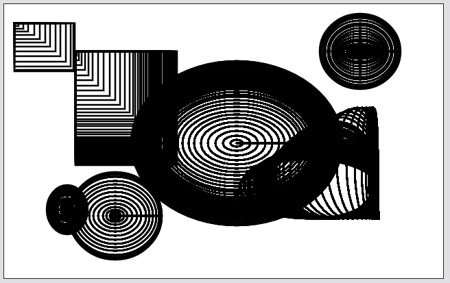

물론 fill을 이용해 중첩된 부분을 가리면 되지만... 문제를 가리는 것일 뿐이지 해결책이라고 할 수 없다.

```javascript
const convasMouseMove = (e) => {
    const x = e.offsetX;
    const y = e.offsetY;
    if (!painting) {
        ctx.beginPath(); // 새로운 경로 생성
        tempCtx.beginPath(); // 새로운 경로 생성 (지우개용)
        ctx.moveTo(x, y); // 시작 위치를 명확히 지정
    } else {
        // 도형 그리기용 정보
        const figureX = Math.min(startX, x),
            figureY = Math.min(startY, y),
            w = Math.max(startX, x) - figureX,
            h = Math.max(startY, y) - figureY;
        // tools
        // ... 중략
        } else if (tool === "rectangle") {
            ctx.strokeRect(figureX, figureY, w, h);
        } else if (tool === "ellipse") {
            ctx.ellipse(figureX, figureY, w, h, Math.PI * 2, 0, Math.PI * 2);
            ctx.stroke();
        }
        // ... 중략
    }
};
```

마우스 이벤트는 도형을 그리는 동안 계속 발생하기 때문에 마지막에 그려진 도형을 제외한 나머지를 지우려면  clearRect를 사용해 캔버스를 비워줘야 한다.

### Rectangle

( + rectangle과 ellipse의 해결 방법이 약간 상이하여 rectangle 먼저 작성함 )

```javascript
const convasMouseMove = (e) => {
        // ... 중략
        } else if (tool === "rectangle") {
            // 이전의 내역을 지우는 코드를 추가함.
            ctx.clearRect(0, 0, canvasWidth, canvasHeight);
            ctx.strokeRect(figureX, figureY, w, h);
        } 
        // ... 중략
    }
};
```

clearRect를 추가하면 도형이 중첩되어 나타나지는 않지만, 사각형을 그릴 때마다 이전 작업물이 전부 없어져 버리는 새로운 문제가 발생한다. 

이를 해결하기 위해서( 작업 내용을 저장할 수 있고 && clearRect 대상이 아닌 ) 또 다른 캔버스를 하나 생성하기로 했다. 

```javascript
// html
<section class="canvas-wrap">
    // 그림이 나타나는 캔버스 (작업 내역이 저장됨)
    <canvas id="canvas" width="640" height="400"></canvas>
    // 실제로 그림을 그릴 수 있는 캔버스
    <canvas id="tempCanvas" width="640" height="400"></canvas>
</section>

// css
.canvas-wrap {
    position: relative;
    display: flex;
    justify-content: center;
}
.canvas-wrap #canvas {
    border: 1px solid #222;
    background-color: #fff;
}
// 캔버스 2개가 하나로 보이도록 겹침
.canvas-wrap #tempCanvas {
    position: absolute;
    top: 1px;
    left: 50%;
    transform: translateX(-50%);
}

// js
// 그림이 나타나는 캔버스 (작업 내역이 저장됨)
const tempCanvas = document.getElementById("canvas");
const tempCtx = tempCanvas.getContext("2d");

// 실제로 그림을 그릴 수 있는 캔버스
const canvas = document.getElementById("tempCanvas");
const ctx = canvas.getContext("2d");
```

캔버스를 하나 더 생성한 뒤,  `canvas`에서 작업한 내용을 `tempCanvas`로 옮겨주는 함수를 작성하고 mouseup, mouseleave를 할 때마다 작업물이 업데이트 될 수 있도록 해당 이벤트에 함수를 추가한다.

2개의 캔버스가 겹쳐져 있어 무언가를 그리면 약간 어색해 보이므로 clearRect를 이용해 `canvas`를  초기화 해준다. 

```javascript
const imgUpdate = () => {
    // 보여지는 tempCtx에 canvas를 update
    tempCtx.drawImage(canvas, 0, 0);
    // clearRect를 하지 않으면 선이 2개로 겹쳐 보임
    ctx.clearRect(0, 0, canvas.width, canvas.height);
};

// mouseup, mouseleave
const notPaint = (e) => {
    painting = false;
    imgUpdate(); // 여기에 추가
};
```

겹친 캔버스를 양옆으로 펼쳐 놓으면 어떤 방식으로 그림이 그려지는지 좀 더 명확하게 이해할 수 있다. (아래의 이미지 참고)


### Ellipse

이제 타원도 예쁘게 그려보자. 어색한 점은 두 가지였다.

1. 마우스를 움직이면 타원이 중복하여 그려짐 (rectangle과 동일한 현상)
2. 마우스를 클릭한 상태에서 여러 방향으로 움직이면 타원이 모여서 다른 도형이 그려진다. (1번 문제와 유사하지만 살짝 다름) 

\=> 이 두 문제는 하나의 Path로 원이 그려졌기 때문에 발생한 것이다.

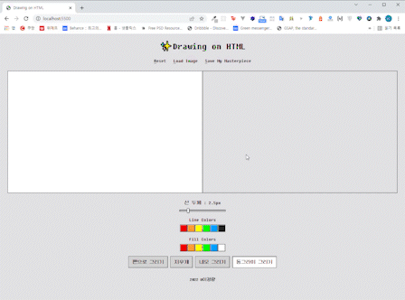

모양이 닫혀있는 직사각형과 달리 타원은 (놀랍게도) 닫히지 않는다. 직사각형과 동일하게 닫힌 것처럼 보이지만 ellipse() 메소드는 조금 다르게 동작하는 것 같다. 

beginPath()를 사용해 원이 그려질 때마다 새로운 패스를 생성하자.
\
아래의 이미지와 같이 원과 원이 하나의 Path로 연결되어 있었다면...

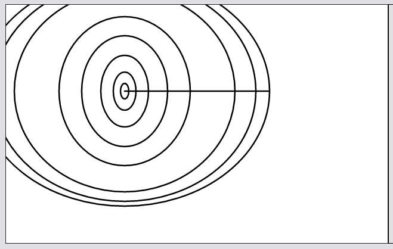

beginPath() 추가 후에는 이렇게 별개의 원으로 분리된다.

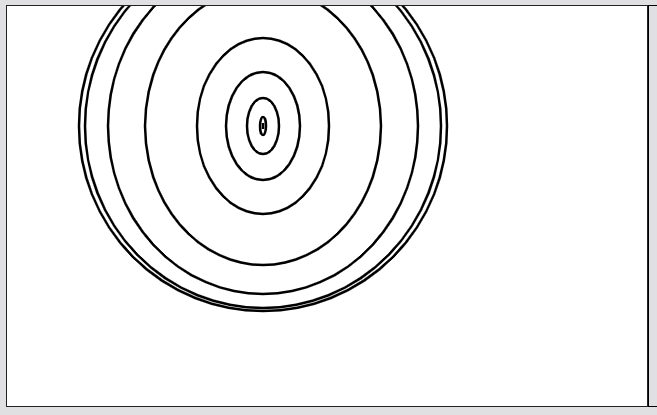

마지막으로 clearRect를 추가하여 마지막 타원을 제외한 나머지 타원을 지워준다.

```javascript
const convasMouseMove = (e) => {
        // ... 중략
        } else if (tool === "ellipse") {
            ctx.beginPath(); // 없으면 마우스를 따라 원이 중첩되며 출력
            ctx.ellipse(figureX, figureY, w, h, Math.PI * 2, 0, Math.PI * 2);
            // 이전의 내역을 지우는 코드를 추가함.
            ctx.clearRect(0, 0, canvasWidth, canvasHeight); // 
            ctx.stroke();
        }
        // ... 중략
    }
};
```

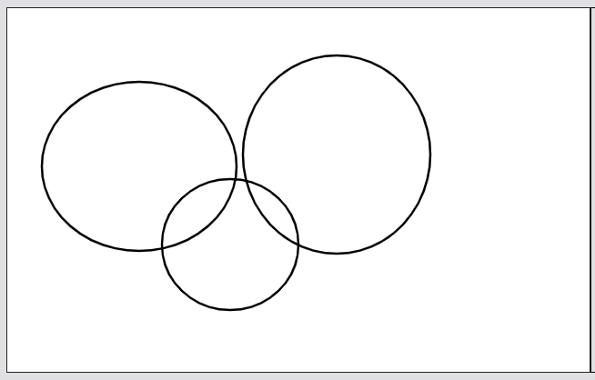

드디어! 원이 아름답게 그려진다... !! 

## 나를 가장 곤란하게 했던 지우개 툴

지우개를 만들기 전에 스스로 정한 규칙(?)이다.

1. 하얀색 펜은 지우개가 아니다.
2. 지우개를 사용하면 영역이 반드시 "지워"져야 한다. 하얀색으로 덧칠하지 말 것.

아직은 이미지 확장자를 선택할 수 없지만(기본 jpg), png로 저장할 경우를 위해 되도록 지우개인 척을 하는 하얀색 펜의 사용을 지양하기로 했다. (그리고 전직 미술 강사로서 화이트와 지우개를 동일한 것으로 여길 수 없다.)

처음에는 마우스 위치에 라인 굵기 만큼의 영역을 clearRect로 지워보려고 했다. 뭔가 잘 될 것 같았지만 예상과는 달리 캡쳐 이미지와 같은 동작을 보여줬다. 

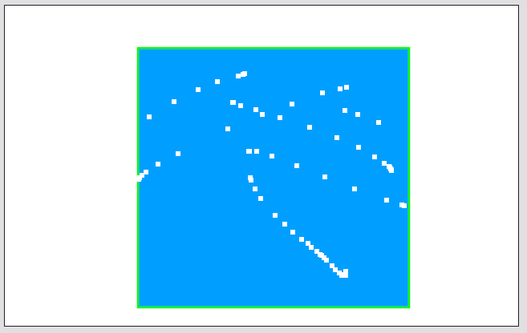

clearRect는 Path가 아니기 때문에 지우개 툴처럼 동작하지 않는다. 펜 툴처럼 부드럽게 움직이며 기존의 컨텐츠를 완전히(투명하게) 지울 수 있는 방법이 없을까?

방법을 찾아보던 중에 ctx옵션 중 `globalCompositeOperation`이라는 것을 발견했다.

[globalCompositeOperation 모질라 문서](https://developer.mozilla.org/en-US/docs/Web/API/CanvasRenderingContext2D/globalCompositeOperation)

모질라 문서를 참고하면 ctx의 `globalCompositeOperation` 기본 값은 `source-over`라고 한다. `source-over`는 평소에 우리가 그림을 그릴 때처럼 이전에 그린 것 위에 이후에 그린 것이 얹어진다는 것을 의미한다.

그런데 `destination-out`으로 설정을 변경하면 겹치는(오버랩 되는) 부분은 투명하게 사라진다.

> destination-out : The existing content is kept where it doesn't overlap the new shape.

이것을 이용해 지우개 기능을 만들기로 했고, 작성한 코드는 다음과 같다. 

**여기서 헷갈리지 말아야 할 것**은 그림을 그릴 수 있는  `canvas`가 아니라 그림이 나타나는(=작업 내역이 저장되는) 캔버스인 `tempCnavas`에 path가 그려져야 한다는 것이다. 왜냐하면 `canvas`에는 어떠한 path도 없기 때문이다.

지우개를 사용한 뒤에는 반드시 `tempCtx.globalCompositeOperation`를 `source-over`로 변경해 주는 것을 잊지 말 자...! (`source-over`로 원복하는 코드는 더 좋은 곳에 추가해도 된다.)

```javascript
const convasMouseMove = (e) => {
        // ... 중략
        } else if (tool === "eraser") {
            tempCtx.globalCompositeOperation = "destination-out";
            tempCtx.lineTo(x, y);
            tempCtx.stroke();
        }
        // ... 중략
    }
};

// mouseup, mouseleave
const notPaint = (e) => {
    painting = false
    tempCtx.globalCompositeOperation = "source-over"; // 초기화
    imgUpdate();
};
```

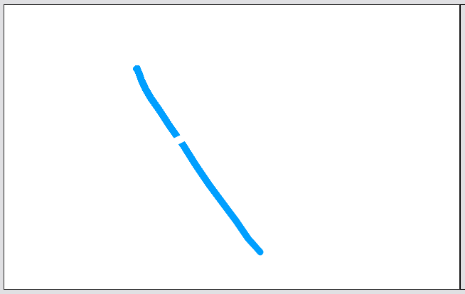

✨예쁘게 지워진다. 

### 지우개와 관련된 문제

여기까지는 그다지 곤란하지 않았다. 지우개와 도형 툴은 완벽해 보였다.

그런데... 그린 그림을 저장하는 기능을 만들고 보니 저장된 그림이 어딘가 이상했다. 지우개로 지운 투명한 부분이  검은색으로 나타났던 것이다.

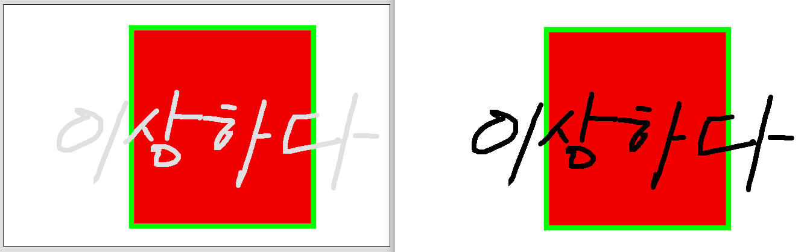

png라면 아무런 문제가 없겠지만 jpg라면 아무래도 신경이 쓰이는 부분이다. 저장할 때 "**투명한 부분**" 흰색으로 변경할 수 없을까? 이때 그려진 그림(원본)은 변경되지 말아야 한다. (강제로 배경을 흰색으로 메꿔보았으나 결국 또 다른 문제가 발생한다.)

열심히 삽질을 하다가 [스택오버플로우의 멋진 답변](https://stackoverflow.com/questions/32160098/change-html-canvas-black-background-to-white-background-when-creating-jpg-image)을 참고하게 되었다.  이 방법이 여태 시도한 방법 중에서 가장 간단하고 깔끔한 것 같다. 

1. 먼저 cloneNode로 캔버스 하나를 복사한다. (cloneNode는 appendChild()와 같은 메소드를 이용하지 않는다면 말 그대로 복사만 된다. 참고 : [모질라 문서](https://developer.mozilla.org/ko/docs/Web/API/Node/cloneNode))
2. 복사한 `newCanvas`를 흰색으로 채운다. 어떤 캔버스를 Clone해도 상관없는 이유는 어차피 흰색으로 전체를 칠해야 하기 때문이다.
3. 이후 drawImage를 이용해 그림이 나타나는(=작업 내역이 저장되는) `tempCanvas`를 `newCanvas`에 복사한다. 
4. `newCanvas`의 데이터를 다운로드 받으면 완료!!

```javascript
const download = () => {
    const newCanvas = canvas.cloneNode(true); // 아무 캔버스 복사
    const newCanvasCtx = newCanvas.getContext("2d");
    newCanvasCtx.fillStyle = "#FFF";
    newCanvasCtx.fillRect(0, 0, canvasWidth, canvasHeight);
    newCanvasCtx.drawImage(tempCanvas, 0, 0);
    const img = newCanvas.toDataURL("image/jpeg", 1);
    const link = document.createElement("a");
    link.href = img;
    link.download = "my_awesome_painting";
    link.click();
};
```

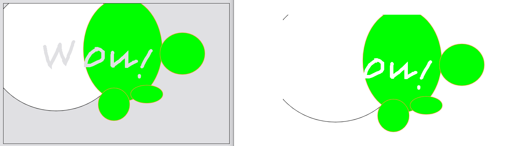

투명한 부분이 아름답게 채워진 것을 볼 수 있다. 

\====================

만들면서 조금 어려웠던 부분을 정리해 보았다. 더 좋은 방법이 있을 수 있지만.. 최선을 다했다. 

더 만들고 싶은 기능은 이 정도이다. 

* 작업 취소 (like Ctrl + z)
* jpg, png 선택하여 저장하기
* 로드한 이미지 위치 선택 기능 (현재 중앙 정렬만 가능)
* 터치 지원 (현재 마우스 이벤트로만 가능)

친구들이 직접 사용하면서 이상한 부분을 알려주었다. 기능이 별로 없긴 하지만 덕분에 이것 저것 고칠 수 있었다. 
만든 무언가를 공유하는 것은 언제나 즐겁다.

### \~받은 작품들\~

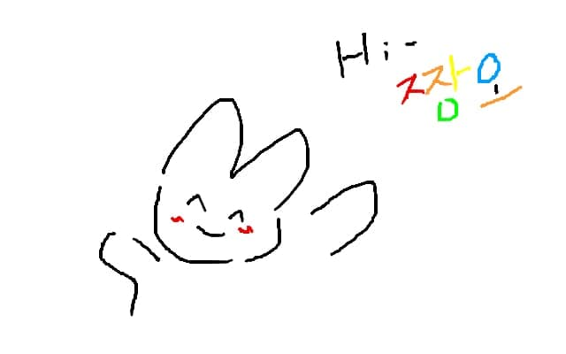

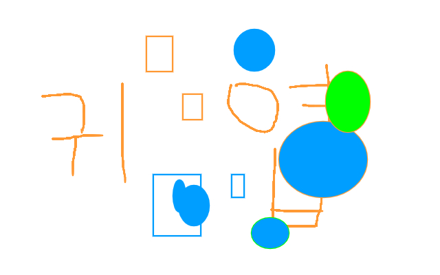


이건 내가 테스트하며 그린 것

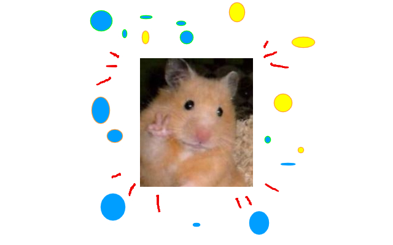