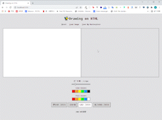

HTML, CSS, Javascript을 이용해 그림판을 만들 기회가 생겼다. 

사용할 수 있는 정도라서 배포해 본 링크 :  <https://drawing-on-html-morgon.netlify.app/>

추가한 기능은 아래와 같다.

## 구현한 기능

* 펜, 지우개, 타원, 직사각형 툴
* 선, 내부 면(Fill Color) 색상 변경 가능
* 지우개, 펜 툴 굵기 조절하기
* 그림 새로 그리기
* 그림 jpg로 저장하기 (품질 : 최대)
* Local 이미지 파일 로드

  * 이미지는 정중앙에 배치
  * 이미지의 가로, 세로 사이즈가 캔버스의 넓이, 높이보다 크거나 같을 경우 자동으로 비율 조정을 하여 이미지가 잘리지 않게 배치
* IE를 제외한 모든 브라우저에서 사용 가능할 것

만들면서 어려웠던 부분은 도형 툴과 지우개 기능이었는데, 사실상 이 둘 덕분에 코드가 2배는 길어졌다고 할 수 있다. 글의 부제를 두더지 잡기로 정한 이유도 어디 하나를 고치면 다른 어딘가에서 문제가 발생했기 때문이다. 

## 도형 툴 만들기

기본적으로  mousedown, mousemove 이벤트를 이용하여 현재 마우스의 좌표를 구한다. 이후 구해진 좌표 값을 이용해 canvas위에 stroke(혹은 기타 그리는 메소드)를 사용하면 canvas위에 마우스를 따라 원하는 그림 그려진다.

펜 툴 + 지우개 툴 만 있는 그림판은 만들기가 간단하다. 그런데 여기서 도형 툴을 추가하면 상황이 조 복잡해진다. 아래와 같이 도형이 중첩되어 그려지기 때문이다..... 


물론 fill을 이용해 중첩된 외곽선을 가리면 되지만 말 그대로 문제를 가리는 것일 뿐, 당연히 해결책이 아니다. 

```javascript
const convasMouseMove = (e) => {
    const x = e.offsetX;
    const y = e.offsetY;
    if (!painting) {
        ctx.beginPath(); // 새로운 경로 생성
        tempCtx.beginPath(); // 새로운 경로 생성 (지우개용)
        ctx.moveTo(x, y); // 시작 위치를 명확히 지정
    } else {
        // 도형 그리기용 정보
        const figureX = Math.min(startX, x),
            figureY = Math.min(startY, y),
            w = Math.max(startX, x) - figureX,
            h = Math.max(startY, y) - figureY;
        // tools
        // ... 중략
        } else if (tool === "rectangle") {
            ctx.strokeRect(figureX, figureY, w, h);
        } else if (tool === "ellipse") {
            ctx.ellipse(figureX, figureY, w, h, Math.PI * 2, 0, Math.PI * 2);
            ctx.stroke();
        }
        // ... 중략
    }
};
```

마우스 이벤트가 매번 발생하기 때문에 마지막에 그려진 도형을 제외한 나머지를 지우려면 어쩔 수 없이 clearRect를 사용해 캔버스를 지워야한다. 

( + rectangle과 ellipse의 해결 방법이 약간 상이하여 rectangle 먼저 작성함 )

```javascript
const convasMouseMove = (e) => {
        // ... 중략
        } else if (tool === "rectangle") {
            // 이전의 내역을 지우는 코드를 추가함.
            ctx.clearRect(0, 0, canvasWidth, canvasHeight);
            ctx.strokeRect(figureX, figureY, w, h);
        } 
        // ... 중략
    }
};
```

이렇게 하면 직사각형이 중첩되어 나타나지는 않지만, 사각형을 그릴 때마다 이전 작업물이 전부 없어져 버리는 새로운 문제가 발생한다.

이를 해결하기 위해서는 작업 내역을 저장할 수 있고, clearRect 대상이 아닌 또 다른 캔버스를 하나 생성해야 한다. 

```javascript
// html
<section class="canvas-wrap">
    // 그림이 나타나는 캔버스 (작업 내역이 저장됨)
    <canvas id="canvas" width="640" height="400"></canvas>
    // 실제로 그림을 그릴 수 있는 캔버스
    <canvas id="tempCanvas" width="640" height="400"></canvas>
</section>

// css
.canvas-wrap {
    position: relative;
    display: flex;
    justify-content: center;
}
.canvas-wrap #canvas {
    border: 1px solid #222;
    background-color: #fff;
}
// 캔버스 2개가 하나로 보이도록 겹침
.canvas-wrap #tempCanvas {
    position: absolute;
    top: 1px;
    left: 50%;
    transform: translateX(-50%);
}

// js
// 그림이 나타나는 캔버스 (작업 내역이 저장됨)
const tempCanvas = document.getElementById("canvas");
const tempCtx = tempCanvas.getContext("2d");

// 실제로 그림을 그릴 수 있는 캔버스
const canvas = document.getElementById("tempCanvas");
const ctx = canvas.getContext("2d");

// 
```


캔버스를 하나 더 생성했다면 `canvas`에서 작업한 내용을 `tempCanvas`로 옮겨주는 함수를 작성하고 mouseup, mouseleave를 할 때마다 작업물이 업데이트 될 수 있도록 해당 이벤트에 함수를 추가한다.

현재 2개의 캔버스가 겹쳐져 있어 약간 어색해 보인다. 이를 해결하기 위해 clearRect로 canvas를 매번 초기화 해준다.

```javascript
const imgUpdate = () => {
    // 보여지는 tempCtx에 canvas를 update
    tempCtx.drawImage(canvas, 0, 0);
    // clearRect를 하지 않으면 선이 2개로 겹쳐보임
    ctx.clearRect(0, 0, canvas.width, canvas.height);
};

// mouseup, mouseleave
const notPaint = (e) => {
    painting = false;
    imgUpdate(); // 여기에 추가
};
```


겹쳐진 캔버스를 펼쳐 놓으면 어떤 방식으로 그림이 그려지는지 좀 더 명확하게 이해된다. 




## 나를 곤란하게 했던 지우개

1. 하얀색 펜은 지우개가 아니다.
2. 지우개를 사용하면 영역이 반드시 "지워"져야 한다. 하얀색으로 덧칠하지 말 것.