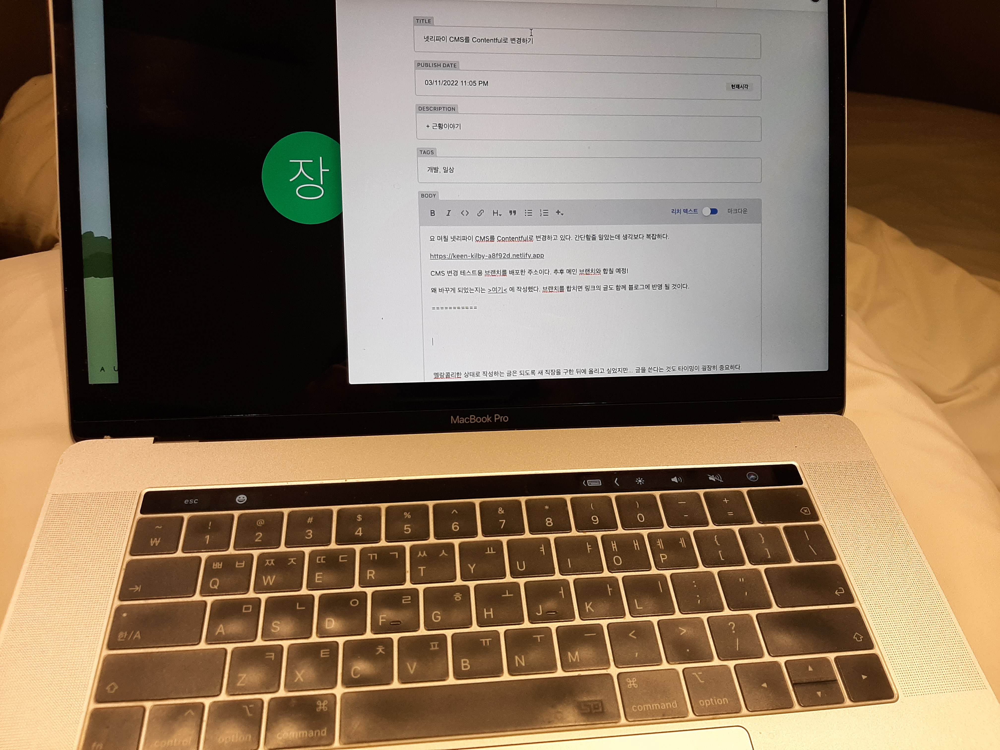
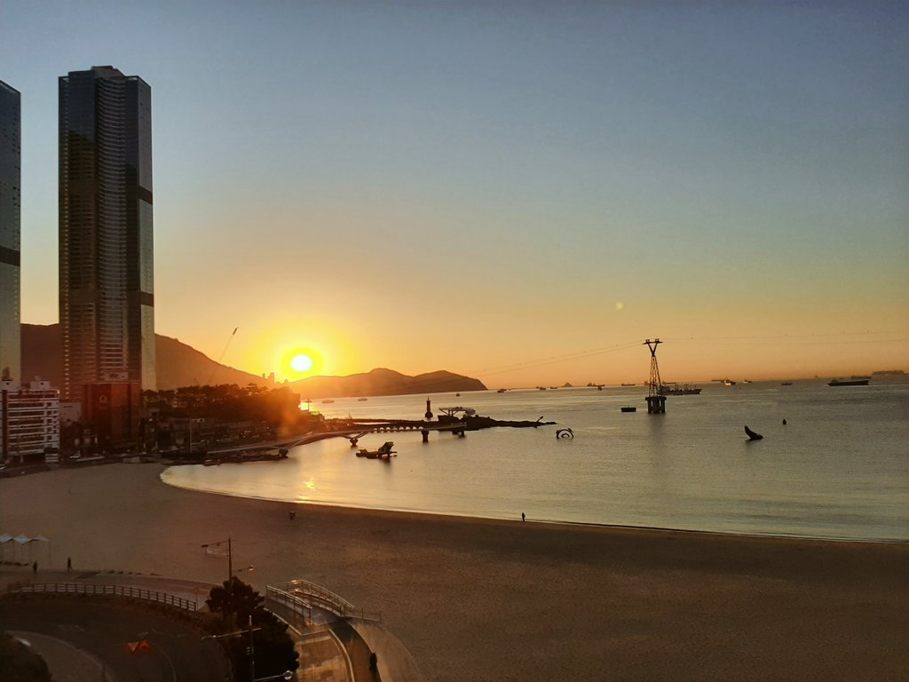

요 며칠 넷리파이 CMS를 Contentful로 변경하고 있다. 간단할줄 알았는데 생각보다 복잡하다. 

[https://keen-kilby-a8f92d.netlify.app](https://keen-kilby-a8f92d.netlify.app/)

CMS 변경 테스트용 브랜치를 배포한 주소이다. 추후 메인 브랜치와 합칠 예정!

왜 바꾸게 되었는지는 [\>여기<](https://keen-kilby-a8f92d.netlify.app/post21) 에 작성했다. 브랜치를 합치면 링크의 글도 함께 블로그에 반영 될 것이다.

\===========

멜랑콜리한 상태로 작성하는 글은 되도록 새 직장을 구한 뒤에 올리고 싶었지만... 글을 쓰는 데 있어 타이밍 굉장히 중요하다. 

마침 나는 코시국 덕분에 홀로 동네 호텔에서 묵고 있는데 지금 글을 써야 할 것 같다고 생각했다.

퇴사를 한 게 엊그제 같은데 벌써 3월 중순이다. 말이 많던 대선도 끝났고, 날씨도 따뜻해졌다. 코로나 확진자는 하루에 20~30만을 왔다갔다한다. 겨우 한달 보름정도 지났는데, 퇴사 했던 날과 많이 달라졌다. 나가자는 마음을 먹었을 때는 정말 빠르게 그만 두고 싶었는데 막상 근무 마지막 날엔 퇴근을 하며 질금질금 울었던 기억이 난다. 

2월에는 엄마도 나도 새출발을 위해 무던히 노력했다. 나는 서류에서 열심히 광탈했고, 이유를 알 수 없지만 엄마는 새 직장에서 하루만에 잘렸다. 동생도 매일 야근에 시달리며 늦은 밤에 귀가했다. 그래서일까? 2월은 내내 기분이 울렁울렁거렸다. 

이렇게 잔잔히 서글픈 상태로 지냈던 2월이 끝날 때, n달전쯤부터 계획했던 짧은 부산여행을 다녀왔다. 서울에 올라오니 3월이 되어있었다. 

이때 확진자가 20만명에 육박해서 동생이 나의 부산행을 엄청나게 불안해했다. 그리고 그 불안함에 부흥하듯... 서울에 올라오는 길에 갑자기 인후통이 생겼다. 휴일이 끝나고 이비인후과에서 신속항원검사를 받았고 양성판정을 받아 당일에 PCR 

물