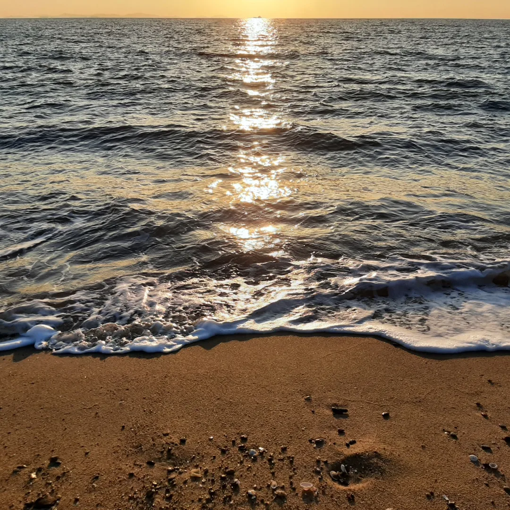

## 마시안 해변

(2022.2.14일 추가)
동생이 오랜만에 휴가를 내게 되어 함께 바다를 보러 갔다. 원래는 제주도로 향할 계획이었지만 오미크론이 본격적으로 유행하기 시작하여 최대한 가까운, 그리고 사람이 적을 것 같은 곳으로 목적지를 변경했다. 

바다는 정말 아름다웠고 (호텔을 제외하고)인적이 드물어서 쉬기에 적합했으나.....
출발하고 얼마되지않아 서류 탈락 연락을 받았던 상태였기 때문에 마음이 매우 복잡했다. 가서도 계속 원티드와 로켓펀치를 뒤적이며 당장 들어가기 어려워보이는 회사들을 보면서 한숨을 쉬었던 것 같다.

막연하게 신입으로 입사할 때보다는 서류 합격률이 높을 것으로 생각하고 있었기에 빠른 탈락이 반복되는 상황이 너무 당황스럽고 두려웠다. 나의 직업 정체성에 대해서도 많은 고민을 했다. 언제쯤 스스로를 당당게 개발자라고 부를 수 있을까?(물론 IT업계에 종사하지 않는 사람들에게는 쉬운 설명을 위해 개발자라고 말하긴 한다.) 내가 3년간 해왔던 일은 도대체 뭐였기에 이직하는 데에 조금의 도움도 되지 않는지... 어디까지 인정되는 경력인지... 이런 부정적인 생각을 많이 했다.

저녁쯤에 바다를 바라보며 커피를 마시고 난 뒤에야 마음이 조금 정리가 되었던 기억이 난다. 다음 바다는 막막한 두려움이 아니라 새 시작에서 오는 즐거운 두려움 속에서 감상하고 싶다.