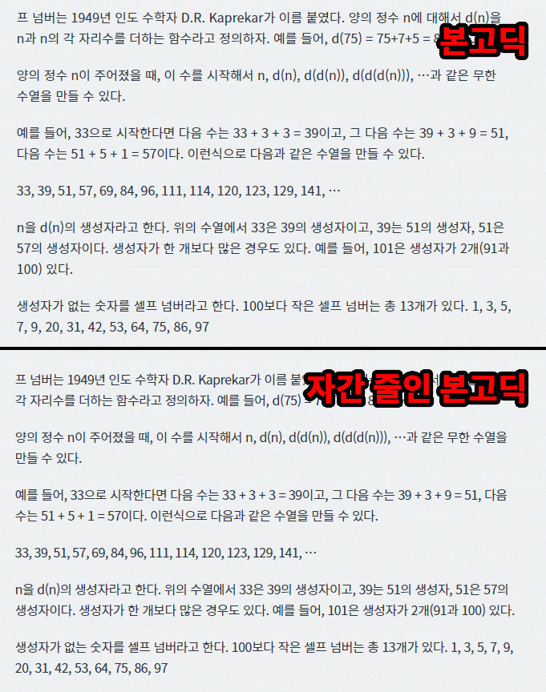
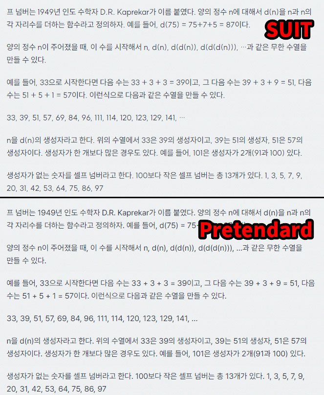

노토산스(본고딕)에 자간을 줄여서 사용하다가 최근 본고딕을 기반으로 하는 아래의 폰트들 알게 되었다.

둘 다 본고딕의 아쉬웠던 점을 보완했기 때문에 적용해보면 훨씬 만족스럽다... 라이센스도 프리함.

[pretendard](https://cactus.tistory.com/306)

[SUIT](https://sunn.us/suit/)

내가 비교하기 좋게 캡쳐 해봄. SUIT와 Pretendard의 눈에 띄는 차이는 숫자와 라틴 문자의 디자인이다. 마음에 드는 쪽을 사용하면 됨.

아름다운 한글 폰트를 위해 노력해주신 디자이너분에게 감사 인사를 드립니다...

