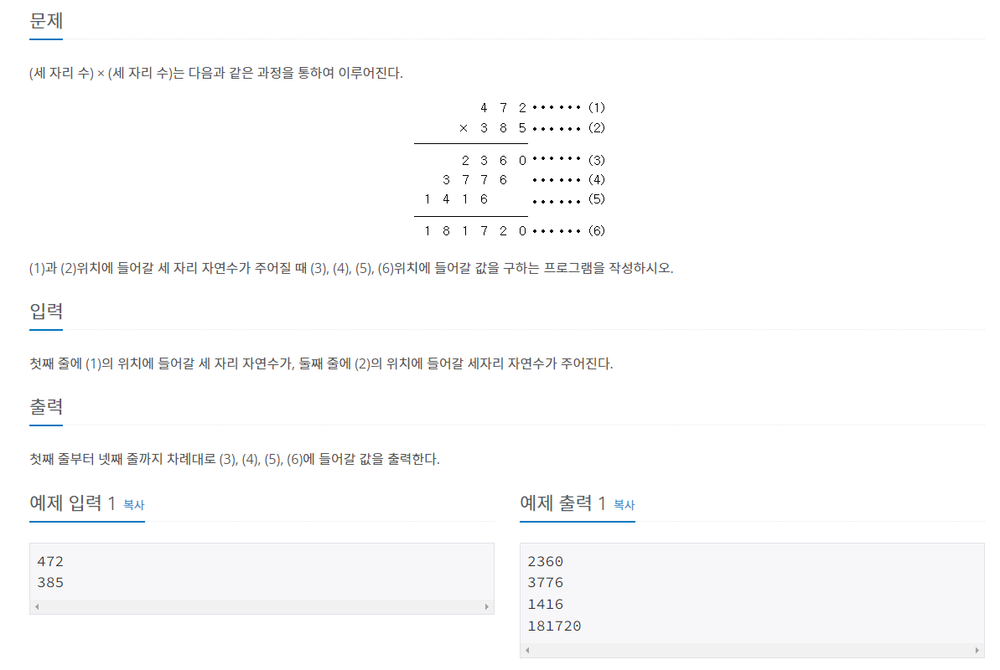

좀만 차근차근 생각해보면 풀 수 있는 간단한 문제이다. 


```javascript
const fs = require('fs');
const [a, b] = fs.readFileSync('./dev/stdin').toString().split('\n').map(v=>parseInt(v));
const firstNum = b%10;
// 첫번째자리 ex. 475을 10으로 나누고 나머지 값 => 5
const secondNum = Math.floor((b%100)/10);
// 두번째자리
// ex. 475을 100으로 나누고 나머지 값 => 
// 75을 다시 10으로 나눈다. => 7.5에서 Math.floor로 정수 값만 가져옴 => 7
const thirdNum = Math.floor(b/100);
// 세번째자리 ex. 475을 100으로 나눈 값 => 
// 4.75에서 Math.floor로 정수 값만 가져옴 => 4
console.log(a*firstNum);
console.log(a*secondNum);
console.log(a*thirdNum);
console.log(a*b);
```