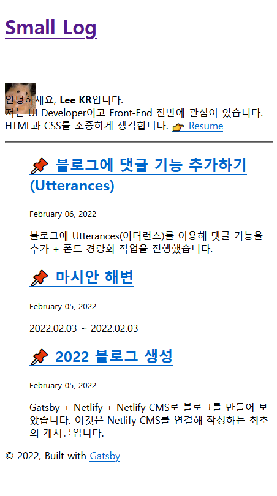
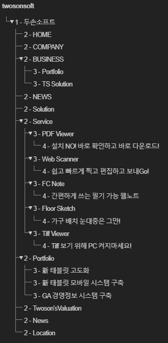
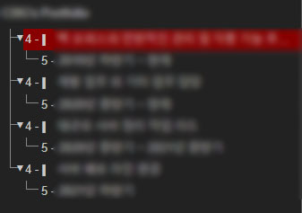
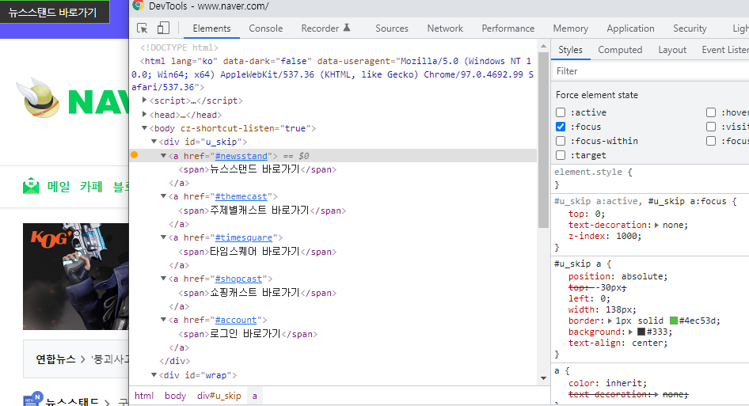

## css를 사용하지 않아도 의미를 전달하는 마크업

> 잘 만들어진 구조적인 ... 페이지는 스타일이 사라졌을 때 오히려 더 잘 작동한다. ... 내내 얘기했듯이 구조를 중요시하고 div 남용을 피해야한다. 다음에 보이는 것과 같은 마크업은 CSS가 없으면 사용자가 이해를 하지 못할 것이다.

```html
    <!-- 이런 마크업은 피하는 것이 좋다. -->
    <div class="header">Headline</div>
    <div class="copy">text</div>
    <div class="copy">text</div>
    <div class="copy">text</div>
```



확인해보니 이 블로그의 마크업은 구조적이다.(theme이니까!) 참고로 파이어폭스 개발자도구에서 css를 전부 비활성할 수 있는 기능을 제공한다.

+ 그리고 개인적으로 사용하고 있는 구글 확장도구 [HeadingsMap](https://chrome.google.com/webstore/detail/headingsmap/flbjommegcjonpdmenkdiocclhjacmbi?hl=ko) 있다. 웹의 근본적인 정체(?)는 문서이기 때문에 헤딩 넘버를 잘 맞춰주는 것만으로도 어느 정도는 컨텐츠의 중요 순서(레벨)를 정리할 수 있다.



전에 작업했던 기업 홈페이지의 헤딩 구조이다. 원래 정리가 안되어있던 헤딩을 정리했었다. 중간에 넘버 하나 정도 뛰어넘는 것은 상관없지만 적어도 메인 헤딩(h1)은 있는 편이 구조적이라고 할 수 있다.



이 사진은 헤딩이 제대로 정리가 안된 모습이다. h4, h5 뿐이다. 아예 헤딩이 없는 경우도 간혹 발견된다.

## 이미지의 alt

굳이 읽어주지 않아도 되는 이미지의 alt 속성은 빈값으로 남겨는 편이 좋다. 굳이 `alt="배경 이미지"` 같은 정보를 제공하지 않아도 된다. 

그리고 의미를 분명하게 전달할 수 있는 alt를 사용하는 것도 중요하다. 예를 들어 홈페이지 로고(보통 클릭하면 메인 화면으로 이동한다.)로 쓰이는 이미지의 alt속성을 적는다면, "홈페이지 로고" 보다는 "홈으로 바로가기 \[로고]" 라고 작성하는 편이 좋다. 

## Skip Navigation

부끄럽지만 나도 스킵 네비게이션이 필요하다는 것을 최근에 알게 되었다. 

메뉴가 많은 복잡한 사이트의 경우, 스크린리더기 사용자들은 매번 많은 메뉴를 하나하나 넘겨야한다. 이런 불편함을 개선하기 위해 메인 컨텐츠로 바로 이동할 수 있도록 도와주는 것이 스킵 네비게이션이다.

마우스 사용자들은 (일부러 TAB키를 눌러보지 않는 이상) 스킵 네비게이션의 존재를 모를 수 밖에 없다. 스킵 네비게이션은 보이지 않다가 focus 되었을 때 보인다.



네이버의 경우 컨텐츠가 워낙 많다보니 컨텐츠를 나눠서 원하는 곳으로 이동할 수 있도록 만들었다. 네이버 외에도 대형 포털사이트나 쇼핑몰에는 전부 스킵 네비게이션이 존재한다. 

메뉴가 없는 가벼운 사이트는 없어도 무방하지만 메뉴가 존재하는 대부분의 사이트는 스킵 네비게이션이 필요할 것이다. 

## Tabindex

참고 링크 1) [Tabindex](https://developer.mozilla.org/ko/docs/Web/HTML/Global_attributes/tabindex)

참고 링크 2) [ARIA](https://developer.mozilla.org/ko/docs/Web/Accessibility/ARIA)

* `tabindex="-1"`은 키보드로는 접근할 수 없지만 JavaScript나 시각적(마우스 클릭)으로는 포커스 가능함을 뜻한다. 즉 상호작용이 불가한 요소들은 기본적으로 `tabindex="-1"`의 값을 가진다.
* `<a>`, `<button>`, `<details>`, `<input>`, `<select>`, `<textarea>` 와 같이 기본적으로 상호작용이 가능한 요소들은 `tabindex="0"` 이 기본값이다. 0 이상의 값은 임의로 TAB의 순서를 정할 때 사용한다. (그러나 사용하지 않는 것을 권고하고 있다. 할 수 있다면 문서의 순서를 논리적으로 배치하자.)
* `tabindex="4"`는 `tabindex="5"`의 값을 가진 요소보다 먼저, 그러나 `tabindex="3"`의 값을 가진 요소 이후에 접근할 수 있다. 만약 `tabindex="0"`인 요소들과 섞여있다면 양의 정수값( 0 < n )을 가진 요소부터 접근한다. 같은 값을 가졌다면 문서의 소스 코드 순서를 따른다. 
* 모질라 문서에서는 `div`나 `span` 같은 비대화형 요소에 tabindex를 추가하는 것을 지양하라고 안내한다. 상호작용이 가능한 태그들은 기본적으로 접근성과 관련된 기능을 내장하고 있기 때문이다. 따라서 가능하다면 의미가 있는 태그를 사용하는 것이 좋다. 그러나 상호작용이 가능한 태그를 사용하기 어려운 상황이라면 ARIA를 사용해서 접근성을 고려할 수 있다.  

ARIA에 대해서는 나중에 한번 정리를 하고 싶다.